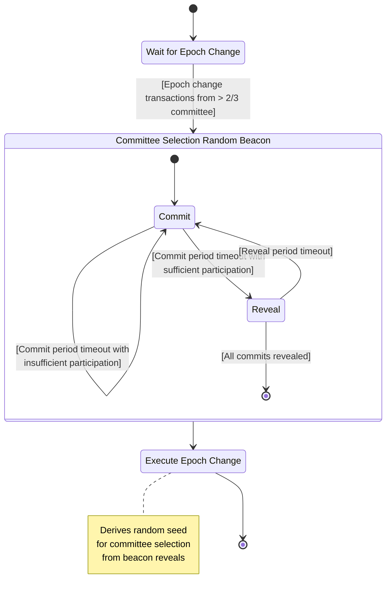

# Committee Beacon

The `CommitteeBeacon` component participates in a commit-reveal process that provides randomness for selecting the next committee. While it does not directly select and save the next committee to application state, it provides the application state executor with a secure and fair random seed for making the selection.

